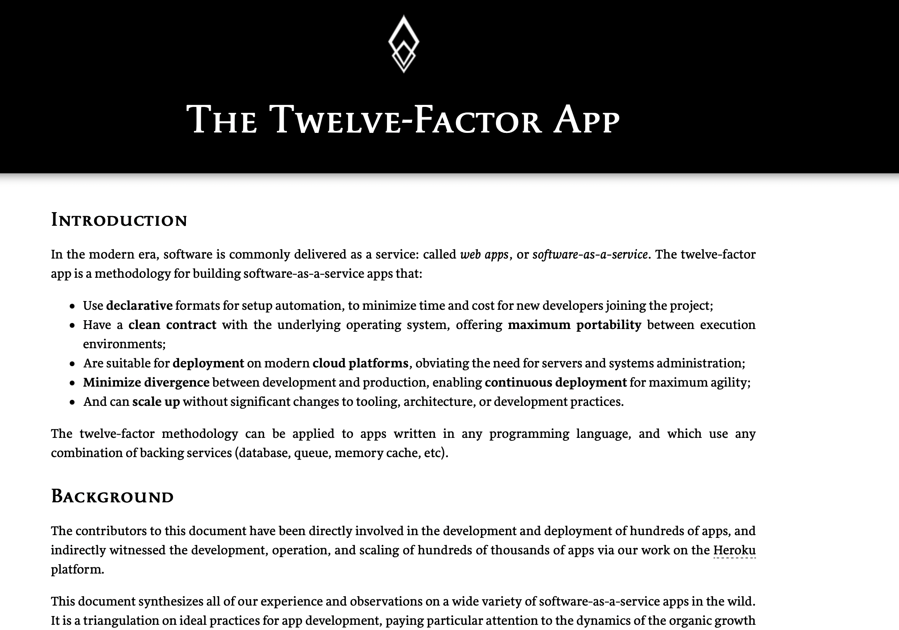
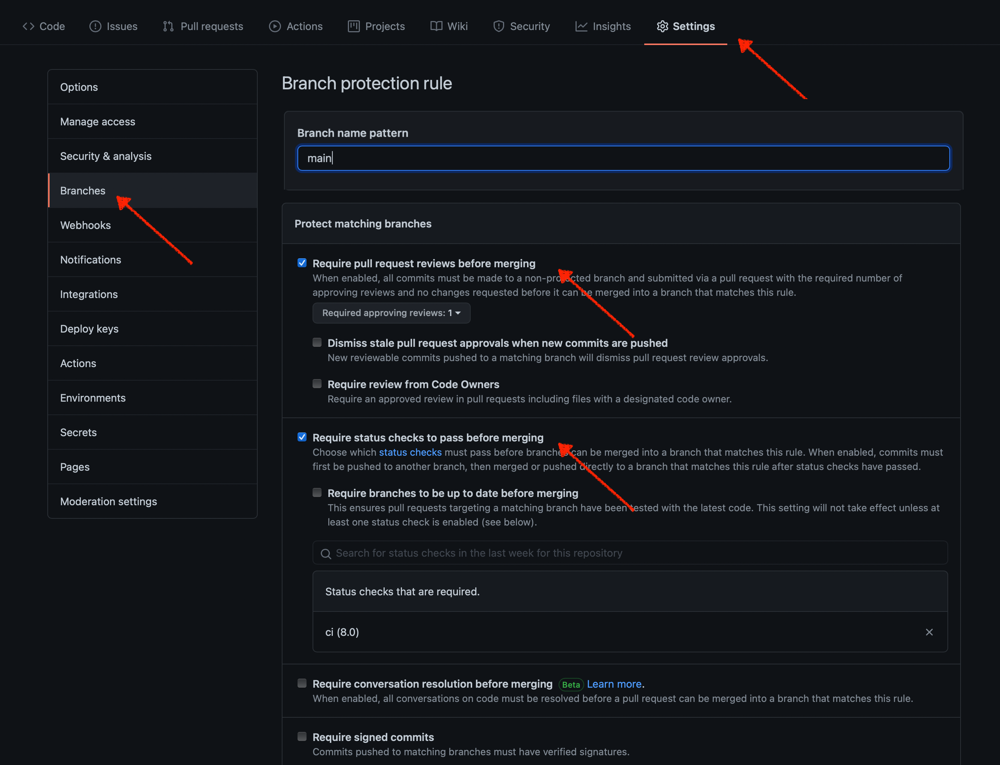
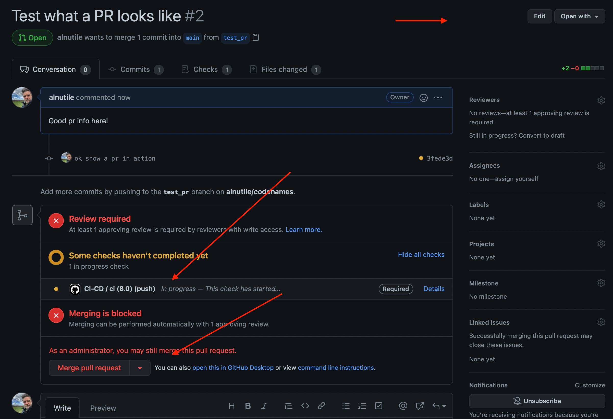

> The point is GitHub Actions should be revolutionizing your team's workflows; if it is not, you are missing something important.

This first post part one of three. I will cover the following subjects in this series.

- PT 1 CI - Simple Continuous Integration using GitHub Actions
- PT 2 CD - Simple Continuous Deployment using GitHub Actions
- PT 3 Security - Shifting Left on Security

Please keep in mind that I share the repository and code below that it is not an end product and will evolve.

If I do not get any interest in this post, I will not do PT 2 or PT 2 as I try to Build Measure Learn [^bml] with writing these articles.

By the end of this post, you will easily be able to add CI to your open-source project, independent private project, team project, or even, dare I say, "enterprise" project. ( more on that later 🤔)

I will reference material in numerous books and research papers you can see [here](https://alfrednutile.info/posts/sod/)

### Continuous Delivery Book

> The commit stage begins with a change to the state of the project—that is, a commit to the version control system. It ends with either a report of failure or, if successful, a collection of binary artifacts and deployable assemblies to be used in subsequent test and release stages, as well as reports on the state of the application. Ideally, a commit stage should take less than five minutes to run, and certainly no more than ten. Humble, Jez; Farley, David. Continuous Delivery: Reliable Software Releases through Build, Test, and Deployment Automation [^cont]

This book is the why behind this article. You can not deliver quality code without a CI system that embraces automation and tooling to vet code quickly. To that end the company paying for this code can not succeed either with out this level of thinking.

> Those who excel at delivering profitability, productivity, and customer satisfaction survive. Anything less than excellence leads to failure. pg 32 [^sod]

> Continuous delivery for the sake of continuous delivery is not enough if you want your organization to succeed, however. It must be done with an eye to organizational goals such as profitability, productivity, and customer satisfaction. pg 49 [^sod]

> Our analysis this year shows elite performers are twice as likely to meet or exceed their organizational performance goals. Pg 54 [^sod]

The quotes make it clear that a company that says NO proper CI and CD is also saying NO to success. And most companies have to see the sentence "We are a company that does x and happens to have a technology team" flipped around to say, "We are a technology company that focuses on x."

### The Twelve-Factor App


To begin with, this is how I started years ago to consider any application I was building. In this article, CI will include the following principles.
 
 1. CodeBase
 1. Dependencies
 1. Config

The article will use the repo [https://github.com/alnutile/codenames](https://github.com/alnutile/codenames) as if it is an application. I mean it is, even though a very silly one.

We will in this case, focus more on the "shifting left" when it comes to "quality and security" and other goals like "peer review-based approval process."

> We recommend that organizations move away from external change approval because of the negative effects on performance. Instead, organizations should "shift left" to peer review-based approval during the development process. [^sod]

And part of this is getting these things right at the CI level. I will apply some base GitHub Actions to the codebase to help confidence in quality and security from the start.

### Accelerate

The book Accelerate [^accelerate] is not just a game-changer; it is a culture-changing strategy that can be implemented on any team today.
Just the habit of working in "small batches" will change the performance level of any team. This book will impact all parts of these three articles.

On that note, the only way to get to the "Elite" levels this book talks about is by putting CI and CD first. You have to believe in it, do it no matter how much time pressure is on your team because it will succeed in the long run. What will not succeed is cutting corners, building technical debt, and having too many non-automated processes between your code and going to production. All of this is proven by the data in this book and the ongoing reports it offers [^sod]

> We also see that elite performers automate and integrate tools more frequently into their toolchains on almost all dimensions. Although automation may be seen as too expensive to implement (we often hear, "I don't have time or budget to automate— it's not a feature!"), automation is truly a sound investment. Pg 60 [^sod]

## Branching

> PR is another way of saying Pull-Request

To begin this CI process and all the GitHub Actions will assume a trunk-based branching process.
Basically, you have "mainline" and ONE level of branching off of that, e.g. the "small batch" of the feature you are working on.
This size of this "batch" should be under four hours of work, ideally, two, to merge two pull requests a day of work.
This strategy will make more sense as I cover Feature Flags in part two of the article.

> Our research shows that effective trunk-based development is characterized by fewer than three active branches and branches and forks having lifetimes of less than a day before being merged to master. Pg 41 [^sod]

All [Pull Request](https://docs.github.com/en/github/collaborating-with-pull-requests/proposing-changes-to-your-work-with-pull-requests/about-pull-requests) will trigger these automations leaving only one real manual step that is a peer developer on the project to review the code WHILE you work on the pull request or the next part of the feature.

Keep that in mind. We are working in small batches. Your code is not a
days worth of work thrown to some poor teammate who has barely enough time to get a hot cup of coffee ☕️. No, it is a small batch of code they can quickly review and even suggest an update for the next PR cause they know you will be at it quickly enough.

Every merged PR is not a final stoke on some great renascence painting but a small step toward building a feature. If you think Build Measure Learn [^bml], you realize that feature might never get used and eventually removed. Some statistics show this to be about 2/3 of the code pushed!

This PR process asks a teammate to review the code, and if they are too busy after thirty minutes, go find someone else. Please keep it to ONE person. This is not a time to philosophize around the merits of style and ideals. Those conversations can happen, but a team should have time to do that during the week and build standards together. Maybe, for example, the reviewer thinks you should not do x, then agree to come back to it later, set up a time to talk as the larger team and or in chat, make a decision, document it, or better add it to automation. These pull requests are about the feature and the known best practices the team has agreed to.

The short of it is, make a branch from trunk, push to your version control system a pull request with the first bit of code-test you write. Get someone's eyes on it sooner than later. When approved, merge that one branch back into trunk (main, master, mainline).

Lastly, if you find yourself waiting for someone to review the branch, you can branch-off of it since, by the time you are done with your second PR, you should have enough feedback from your teammate to merge and then rebase your current branch from trunk. Leaving you ever one branch out at most from trunk.

One good question I had asked about this was, "Won't this distract my team from the work they are doing if all day there are looking at PRs" and I asked the team about this, and overall, the answer is no. For one, these are small batches of work; the dev does not have to switch their context that significantly unlike if they are handed days of code. Second, the devs do not and should not be coding eight hours a day. There should be other things going on in their day to make sure the health of the project and team are being built and maintained as well. We are preventing debt by doing this.

## GitHub Actions

Okay, this is huge; we are going to start talking about [GitHub Actions](https://github.com/features/actions). And yes, GitLabs and BitBucket have comparable features, so this article can be considered for all of them. The point is GitHub Actions should be revolutionizing your team's workflows; if it is not, you are missing something important. It empowers DevOps at the developer level in a way that years ago took heavy server administration skills to set up. But now it is like Lego bricks, pre-built automation to truly shift-left in all things.

### Step One: Setting up the actions

This is easy; I will show you in order every action used to make this all happen.

First, it happens in one file [https://github.com/alnutile/codenames/blob/main/.github/workflows/ci-cd.yml](https://github.com/alnutile/codenames/blob/main/.github/workflows/ci-cd.yml) maybe it can be broken up into more, etc. I am not a GitHub Actions expert, so feel free to Google more about this.

We start with the "when" to run the action.

```yml
name: CI-CD

on: [push]
```

The "when" in this case is when code is pushed to any branch we run this.

Okay, then there is some base setup I will breeze over since the GitHub Action Docs are good and I rather focus on the "how" and "why".

```yml
runs-on: ubuntu-latest
env:
  DB_DATABASE: test
  DB_USERNAME: root
  DB_PASSWORD: password
  BROADCAST_DRIVER: log
services:
  mysql:
  image: mysql:5.7
  env:
  MYSQL_ALLOW_EMPTY_PASSWORD: false
  MYSQL_ROOT_PASSWORD: password
  MYSQL_DATABASE: test
  ports:
    - 3306/tcp
  options: --health-cmd="mysqladmin ping" --health-interval=10s --health-timeout=5s --health-retries=3
strategy:
  fail-fast: true
  matrix:
  php-versions: ["8.0"]
```

So we are going to lean heavily on [https://github.com/shivammathur/setup-php](https://github.com/shivammathur/setup-php) and after we check out our repo

```yml
steps:
  - uses: actions/checkout@v2
```

Once that is done, we can get to work.

I set up PHP with some extensions I need, especially Xdebug even though it slows things down.

```yml
- name: Setup PHP, with composer and extensions
 uses: shivammathur/setup-php@v2 #https://github.com/shivammathur/setup-php
 with:
 php-version: ${{ matrix.php-versions }}
 tools: phpmd
 extensions: mbstring, dom, fileinfo, mysql
 coverage: xdebug #optional
```

I then prepare the application:

```yml
- name: Start mysql service
 run: sudo /etc/init.d/mysql start

- name: Get composer cache directory
 id: composer-cache
 run: echo "::set-output name=dir::$(composer config cache-files-dir)"

- name: Cache composer dependencies
 uses: actions/cache@v2
 with:
 path: ${{ steps.composer-cache.outputs.dir }}
 # Use composer.json for key, if composer.lock is not committed.
 # key: ${{ runner.os }}-composer-${{ hashFiles('**/composer.json') }}
 key: ${{ runner.os }}-composer-${{ hashFiles('**/composer.lock') }}
 restore-keys: ${{ runner.os }}-composer-

- name: Install Composer dependencies
 run: composer install --no-progress --prefer-dist --optimize-autoloader

- name: Prepare the application
 run: |
 php -r "file_exists('.env') || copy('.env.example', '.env');"
 php artisan key:generate
```

We depend on `composer.lock` as being part of this. One key thing here is to never reference `dev-master in your composer.json file. Please make sure you use the MAJOR version that you want and let itself updated at the MINOR version levels [^sem]

Okay, now we have the system setup, PHP, MySQL, Composer files installed, and the `.env` setup.

> We're sucking diesel now!

Now let's check our code for "quality." Before we do that, let's ask what quality is? Some of it is opinion-based, but as a team, something is better than nothing. A bar, a standard, something you all can agree to. The choices I show here are used in actual day to day work and does not slow down the team. But at the same time, it catches those little things and helps us to have consistent code that we can all share the workload on.

```yml
# Setup Done now to test and lint the code
- name: Run PHPMD
 run: phpmd app GitHub phpmd.ruleset.xml
```

To begin with, we use [PHPMD](https://phpmd.org) as a simple way to verify some standards and or quality. There is a ruleset file that the team can
modify as needed.

```yml
# Run linting to make sure it is worthwhile before NPM
- name: phpstan
 run: |
 ./vendor/bin/phpstan analyse
```

[PHPStan](https://github.com/phpstan/phpstan) is a Static Analysis Tool

> PHPStan focuses on finding errors in your code without actually running it. It catches whole classes of bugs even before you write tests for the code. It moves PHP closer to compiled languages in the sense that the correctness of each line of the code can be checked before you run the actual line.

It can catch many little things that our Unit tests (more on those in a moment) may not catch. Another option is [LaraStan](https://github.com/nunomaduro/larastan) to help with the more specific Laravel code styles that may throw off PHPStan. Note we are not "boiling the ocean" here, we are setting things to levels that are "good enough". Finding the right balance for your team is key here.

```yml
# Again another lint before we do the js build
- name: PHP Code Style (phpcs)
 uses: chindit/actions-phpcs@master
 with:
 cli: "--standard=PSR12"
 dir: app/
```

This one will help with linting, and some agreed to standards amongst the team. This makes our PR process not about looking at style but looking at logic.

```yml
- name: Test with phpunit
 run: XDEBUG_MODE=coverage vendor/bin/phpunit --coverage-text --coverage-clover clover.xml
 env:
 DB_PORT: ${{ job.services.mysql.ports['3306'] }}

- name: Do we pass the coverage amount
 run: vendor/bin/coverage-check clover.xml 60
```

Okay, this is the big one-time to PHPUnit test. Sixty percent is a bit low. I think 70% is a better goal. I will quote Kent Beck about 100%. Also note we focus on the [Happy Paths](https://martinfowler.com/bliki/UserJourneyTest.html)


No Dusk tests? Right, so I might add Dusk for some End2End. The work I do day to day depends on Python Pytest for End2End testing. Since those projects have an embedded QA person, they tend to know Python. Dusk is , fantastic and there are actions running selenium and what not, so it should plug in fine. Maybe I will come back later to this. If this app had a JavaScript framework like VueJS I would not use Dusk I would use Jest or some other well-known testing framework for JavaScript. Since this app is Livewire, I depend on its testing at the PHPUnit level, but I do see the value here of some e2e testing in Dusk.

Okay, so that is it; you now have these automations running with every PR. Let's see what a PR looks like.

### Step Two: Using GitHub Branch Protection

First, we have to get GitHub into a place that "forces" a PR flow. Honestly, a team should have "trust" enough maybe not to do this but two things here. One it prevents accidents. We have all been on the wrong branch before and pushed up without seeing. Second it can help with management to know there are guardrails.



We set the rule to match our trunk branch `main`
We make sure that all Pull Requests require someone to create a PR beforehand and have one approver. Finally, we add this one Status check to pass before we can merge this into trunk.

Below is an example.



What we get here is a Pull Request interface to see the critical aspects of this workflow.
The upper right corner will be a Green "Review Pr" button if another team member was looking at this PR.

The middle section shows the running state of the Actions we made above and if they pass or fail. If they fail, then no matter what, we can not merge this easily.

Lastly is the "break glass" button to merge the PR if you are an admin. This will be Green if your PR is approved and the Actions are all passing.

That is it really for the PR. Review, comment, or approve, and your team is ready to have a high-speed flow to ensure quality is in from the start.

## Final Thoughts

### tl;dr

Take time to automate and place tools from the start of the chain in place to make sure quality is baked in. As your deploy code to production multiple times a day (coming in part two of this), you will see how important this is to speed and stability. And Actions let you do this easily.

### Enterprise

> Developers should be empowered to do ops, and this is a great place to start.

I mention this above and just want to take a moment to say that even a solution this simple is better than nothing. Developers should be empowered to do ops, and this is a great place to start. Actions do not require different teams to approve or implement. It can streamline the work it takes to innovate, and innovation at this level will work its way up to the business as the data in Accelerate shows over and over again.

## References

[^sod]: [State of DevOps Report 2019](https://www.dropbox.com/s/b856g72dkzjjriq/state-of-devops-2019.pdf?dl=0)
[^cont]: [https://www.amazon.com/Continuous-Delivery-Deployment-Automation-Addison-Wesley/dp/0321601912](https://www.amazon.com/Continuous-Delivery-Deployment-Automation-Addison-Wesley/dp/0321601912)
[^accelerate]:

[Accelerate](https://www.amazon.com/Accelerate-Software-Performing-Technology-Organizations/dp/1942788339)
[^sem](https://semver.org)
[^bml]: [https://www.mindtools.com/pages/article/build-measure-learn.htm](https://www.mindtools.com/pages/article/build-measure-learn.htm)

## Links

- [Intro Post to all things State of DevOps](https://alfrednutile.info/posts/sod/)
- [PHP Actions](https://github.com/shivammathur/setup-php)

## Follow Up

- I will work on using CodeClimate as a code check action since this works with so many languages and seems to plugin easily using docker
