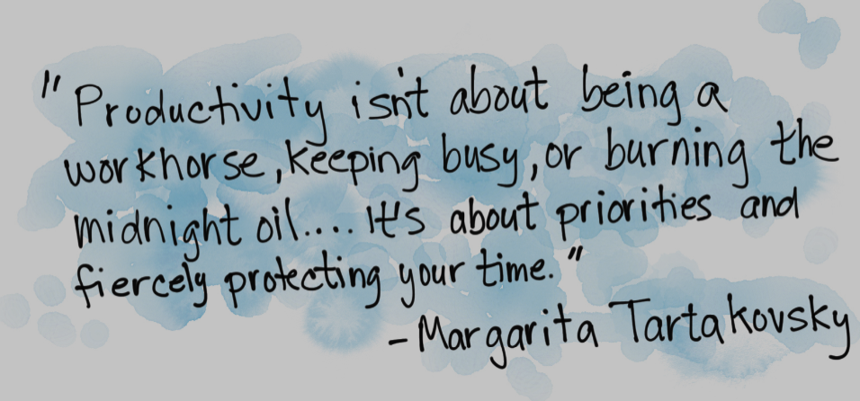

> How do we go on the "offensive" leaving behind what has only become a "defensive" effort to save our day from becoming unproductive?  Leaving us at the end of the day feeling like we need to make up some time after work or the weekend

This post will be a look at how to manage your time in the midst of what can seem to be endless distractions and too many things needing to be done at once. It may seem mostly from a developer's perspective, but it might help others who feel like they no longer have enough time to focus during the workday to get their actual work done. In the end, I hope to show that part of being a professional developer or many other roles is knowing your limitations of time. Knowing your limits, you can say "Yes" to requests with confidence and "No" to requests because you can see the more negative significant impact of saying yes will have on the project and on you as a professional.

## Day to day "popcorn" interactions

Even before all the chat systems we now use, the day could quickly have been filled with numerous interruptions. Working in an office with your teammates knocking on your door for small talk while you are working through complex coding logic only to have it all topple over like a house of cards when that person asks, "how was your weekend" or "have you see the show…." Or "what are you working on?"

And now, with these chat systems as an integral part of our remote work-life, we further have our time filled with "obligations" to respond to others. How do we go on the "offensive" leaving behind what has only become a "defensive" effort to save our day from becoming unproductive?  Leaving us at the end of the day feeling like we need to make up some time after work or the weekend (btw, I typed workend here by accident, hmm). Or maybe even worse, feeling like you are no longer able to experience those creative flows and those days that leave you with a sense of accomplishment.

## Setting expectations

To begin with, I want to first make clear that this strategy will not try to achieve an eight-hour day of total flow or focus. You will never get there, nor do you need to. Sure, you might have enjoyed that at the start of your career, but looking back, I think many of those hours working had really been learning your skills, so that what took eight hours then takes two hours now. This does not mean you have six hours to do more. But my goal is to help you find those two to four hours a day to once again have that feeling that you created something or completed something that really was the work you knew you had to do.

With this in mind, part of the work is figuring out how to manage those other hours you have in the day to consistently protect the hours you need to get your job done. One thing I think that has to be realized here is the "flow" that you might have experienced in the early years; hacking on code for eight hours a day is actually to your detriment today. Anyone working on a feature or project needs time to check out from "the flow" to make sure they are still on target. This "small batch" flow is key to pivot and not getting so attached to your work that you avoid change.

> In software organizations, the capability to work and deliver in small batches is especially important - Forsgren PhD, Nicole; Humble, Jez; Kim, Gene. Accelerate (p. 131)

> Lean manufacturers discovered the benefits of small batches decades ago. - Ries, Eric. The Lean Startup: How Today's Entrepreneurs Use Continuous Innovation to Create Radically Successful Businesses (p. 186).

## Scheduling

Depending on your situation, there are different options here. Sometimes you are working on a feature with deadlines and have to get a certain amount of work done in a certain amount of time. But even then, you have to communicate with your boss about your progress or lack of it. Doing this in a scheduled manner can help you get lost in work and have one of those "wow, what happened to the day" moments not checking in with anyone to proactively give them a sense of the status of the work in progress. This puts you in the "offensive" mode by proactively giving reports about the status of the work being done. A manager should listen to your situation, and with your help, assess if an update should be given to the product owners. Also giving your team time to consider the overall timeline and not end up having to pull all-nighters just to create something that is a fraction of what it should have been.

> By creating a safer system of work, the value they created included fewer late night cram sessions, with more time to develop new, innovative features. - Kim, Gene; Humble, Jez; Debois, Patrick; Willis, John. The DevOps Handbook (p. 137)

To do this, break up your day into chunks ahead of time. For example, Monday, the first thing is to set up your calendar for all the times you need to get the work done for the week. For example, if you work better in the morning, protect that with your life. Need to take a walk in the day to get going again, schedule that in. You need to put this in a system so when you are asked if you can attend meeting x or y you can say "No" and then suggest options. Either way, part of being a professional is knowing what it takes to produce professional-level work. And staying up late at night when you are tired and worn out from a day of meetings will not produce that level of work ever.

> part of being a professional is knowing what it takes for you to produce professional-level work

Again you are not blocking out six hours or four hours. Aim for small batches of forty-five-minute chunks. During that time, close all chat rooms, do not multitask (more on that shortly), close email, close Twitter, close all social networks, etc. Turn off phone notifications (you can typically set your phone to allow calls from people in your contact even when silenced). Then after this time is up, open all those up again, work comms especially and see if anything needs your attention. Or walk, stretch, do those other things that make you able to work well. For me, immediately after coming out of a 45-minute flow, I will write in my notepad (Evernote, Bear, Notes, whatever) what I was working on and where I left off; this way I can more easily get back into it after the check-in phase.

## Something came up I must do it now?

Those moments that you do come up for air and look at all the different communication channels and some things need your attention; what do you do? Well, each situation will vary, but here are some ways to assess and manage them.

First, chat systems like Slack, Teams etc. are good tools, but sometimes you can save time by just taking a moment to do audio and if needed, video with the person making the request. Then you can talk with them about when do they really need this request to be taken care of. Sometimes just by having the moment of more personal communications, everyone can take a breath and truly assess how urgent the situation is.

Then if it is something that truly needs to be done now, you should take a moment to look at your schedule. If there is something else due this week and you now no longer have time to do that, outside of working the weekend or late at night, and this person is your boss, let them know. Sometimes managers need to hear that cost to what they are asking. "If I do this today that that other feature can not get done till next week, and the chain effect goes on from there!".

> Saying "Yes" to everything is not going to help anyone in the long run.

Saying "Yes" to everything is not going to help anyone in the long run. As you are starting out, you may feel this is key to getting more work, or getting ahead, and honestly, it might be. Still, at some point, part of being a professional is knowing when the direction of the situation will have a negative impact on the project. This can be from you knowing you have to cut corners in the code or security or what not to get the other work done. Or knowing that you have to work late nights and weekends will lead to less quality work, and eventually, you will be burnt out. Come to think of it, most of my "oh carp moments, e.g. a deleted database, deleted application, destroyed server, etc., happened when I was tired and working late or lacked sleep.

Another thing to consider is that people on the other end of the request, once they understand how busy you are and know that you can give it your full attention at such a time, understand and be ok with you not doing it now. Ironically I was on the other end of this last week, assuming my important task would have been first on a colleague's schedule. One video chat later reminded me he has a few other things on his immediate list to get to first, and I was reminded my request is not the only one on his plate.

Second, by actually asking when is this needed, you can see how it can fit into the schedule you already made for your week. One good way to do this is to say, "What is the latest this can get done" and then see how it fits into your schedule. Heck, you might have an opening tomorrow, and they want it next week, but you can just get it done. Because you took time to slot out your schedule, you can be more "offensive" in your scheduling than defensive and reacting to all the "newest" things coming in.

## Saying No

Saying "No" or "Not now" for some might be hardest part of all of this, especially when we are coming up in your career. It may be scary since you want to be the go-to person the next time something important comes up. But saying no the right way means saying yes to the overall goal of a project, team, and company culture. You are saying "no" not because you do not want to do something but because you are actually saying "no" to some other item on your calendar by saying "yes" to this request. You are saying "no" to the quality of another feature down the line. Or you might be saying "no" to some training you had on your schedule for a month now. Or maybe saying "no" to technical-debt, or the personal time needed so you can remain healthy.

One immediate place to consider saying "no" to is meetings. Not to all meetings but ones you do not have to be in. I know it can feel nice at first to be asked to meetings, but many of them you really are not needed. Let's say you have a standup every day and retro at the end of two weeks. Then you have a planning meeting as well that can be one to two hours long. Your day and week already have several scheduled meetings breaking it up. And after you put your 45-minute chunks on the calendar, you might not have a ton of other time for these impromptu meetings. So you can say no to those meetings, or if the meeting is needed, try to tie it to the end of another meeting, so you are not having two meetings breaking up your time.

Or course sometimes the meeting is required and takes hours, again a manager needs to realize the cost of this. This meeting cost of getting a feature X done this week and feature Y next week! Do not assume they know this. And if that manager can not consider that cost or thinks you can just work the weekend, you really need to consider if this is the right team for you.

## Walk away from chat

When will email go away for work communications now that most of it takes place in chat? Most of us are currently on some type of chat system for work, often trying to manage several conversations at once because we do not want to wait for the other person to write back. Sure chat is a very fantastic tool helping us more easily share information when a phone call or email would be too much or too slow, but it has its limits.

As mentioned above, the key to any of this is turning these things off, including chat when you start your focus time. In forty-five minutes flow, NOTHING is going to happen that you can not miss. Sure, you need to keep up with things but NOT every minute of the day and not five different things at once.

When you are on your "chat" time, I would suggest knowing when it is best to turn a chat question into an audio call (video can sometimes depend on the situation). This can save you time waiting in the chat for someone to type back and prevent the complications from trying to explain something complex in chat.

Even though, for me, there is sometimes a productivity buzz that comes popping around multiple chats "helping out." But rarely does that last long or end up going well, from my experience. Either I lose momentum for the work I am supposed to be getting done, or before long, I get wires mixed in one chat vs. another and end up causing more work and confusion than I might have saved.

## Too much WIP

Another common issue with saying "yes" to all things is you end up having too much work in progress or WIP. I will quote a couple of books about this to show that it is not a good place to be. Hopefully this will help you to see that in saying "No" you are preventing this condition from happening which is proven to lead to projects and teams failing.

> To enable fast and predictable lead times in any value stream there is usually a relentless focus on creating a smooth and even flow of work, using techniques such as small batch sizes, reducing work in process (WIP), preventing rework to ensure we don’t pass defects to downstream work centers, and constantly optimizing our system toward our global goals.- Kim, Gene; Humble, Jez; Debois, Patrick; Willis, John. The DevOps Handbook (p. 53)

> Small batch sizes result in less WIP, faster lead times, faster detection of errors, and less rework. - Kim, Gene; Humble, Jez; Debois, Patrick; Willis, John. The DevOps Handbook (p. 69)

> Almost every Lean Startup technique we’ve discussed so far works its magic in two ways: by converting push methods to pull and reducing batch size. Both have the net effect of reducing WIP. - Ries, Eric. The Lean Startup: How Today's Entrepreneurs Use Continuous Innovation to Create Radically Successful Businesses (p. 201)

## Embrace interruptions

Part of this strategy is something it took me a while to realize, and maybe having a kid helped with this, you will be interrupted, and it will impact your focus; the question is how to minimize the impact. Be rigid enough that you create the space you need to get your work done, but at the same time be flexible enough to respond to these interruptions knowing that since you planned out your schedule, you can shift things around.  And if all the pieces do not fit, you can communicate to your boss what will be impacted, days before it becomes a "surprise."

> Be rigid enough that you create the space you need to get your work done, but at the same time be flexible enough to respond to these interruptions

As I noted above, I have a scratch pad that I jot down notes about "Where I left off" so I can jump back in after the call or break. Other than that, depending on the size of the interruption, you might need to adjust the rest of your schedule. Trying to make up the time rarely goes well, from my experience. Sure, you can sacrifice that lunch away from the desk or mid-day walk, but you are in a marathon, not a sprint.

## The illusion of multitasking

Ok, this is a tricky subject. So many people swear they can do this. So, for now, I will just talk to those who feel it is not working for them.

I would point you to these books:

> Studies have shown that the time to complete even simple tasks, such as sorting geometric shapes, significantly degrades when multitasking. Of course, because our work in the technology value stream is far more cognitively complex than sorting geometric shapes, the effects of multitasking on process time is much worse. - Kim, Gene; Humble, Jez; Debois, Patrick; Willis, John. The DevOps Handbook (pp. 65-66)

> The truth is wholly the opposite in almost every circumstance, if neuroscience is to be believed. In study after study, we’ve found that we are slower at completing tasks when we switch from one activity to another than we are when we simply repeat the same activity. In other words, if you shut down every tab of your browser, mute your phone, and close your email inbox, you’ll finish the memo you’re writing in significantly less time. - Headlee, Celeste. Do Nothing (p. 95)

> The truth is wholly the opposite in almost every circumstance, if neuroscience is to be believed. In study after study, we’ve found that we are slower at completing tasks when we switch from one activity to another than we are when we simply repeat the same activity. In other words, if you shut down every tab of your browser, mute your phone, and close your email inbox, you’ll finish the memo you’re writing in significantly less time. - Headlee, Celeste. Do Nothing (p. 95). Potter/Ten Speed/Harmony/Rodale. Kindle Edition.

## Summary

I wrote this because it took me a while to really understand how important managing my schedule is. Hopefully, with the above information, you can start to see your day, week, and weeks adding up to getting "more" of the right things done both for work and for your career and health.  Feel free to join our Stratus Open Office hours if you have any questions or post on Yammer's comments.
