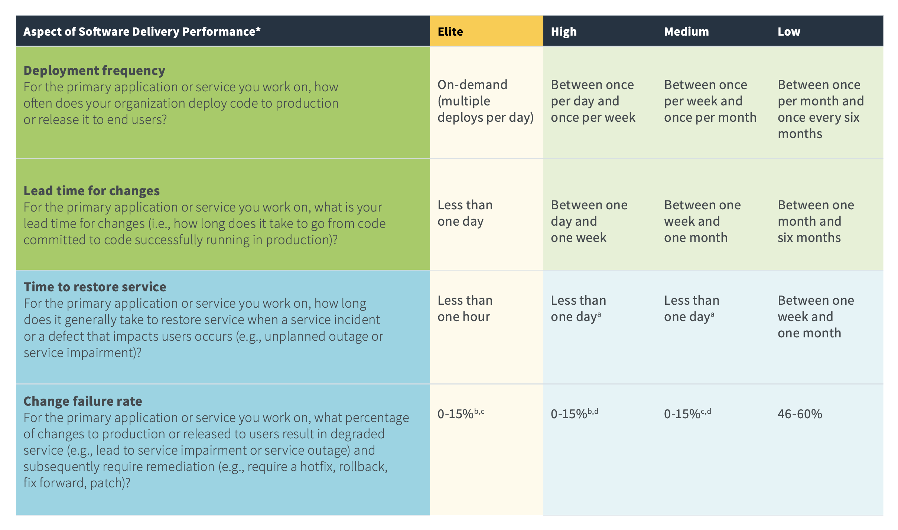
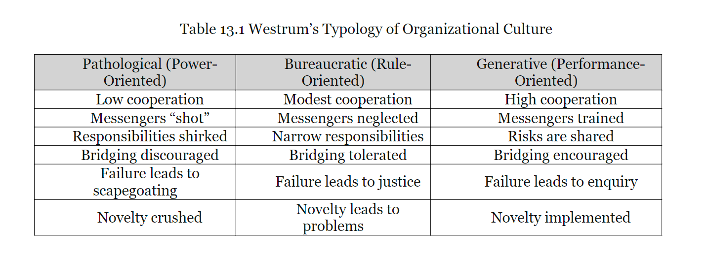
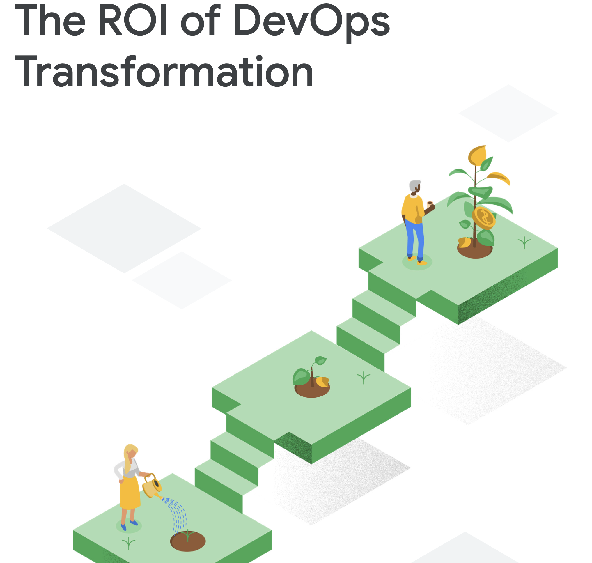
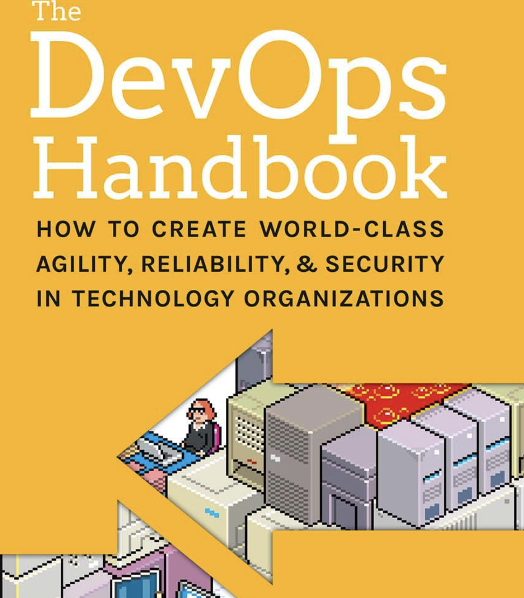
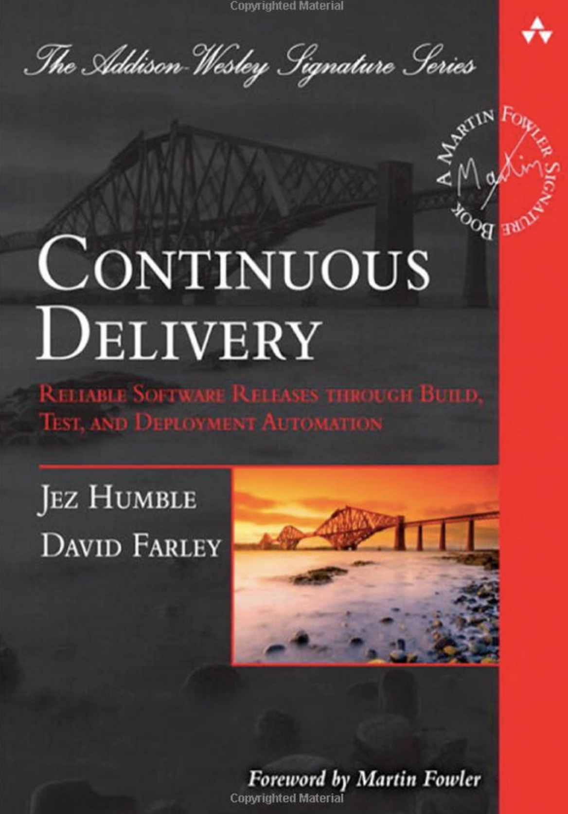

Next time I needed this info, I just wanted to make sure that I have the links I need concerning the Accelerate book and Software Delivery Performance. So I will use this page to continue to add info about these resources.

The links below really are all related as the authors work together in the different books, videos and research papers.

## TL;DR

The most critical link [State of DevOps Reports](https://www.devops-research.com/research.html#capabilities)

As they go into articles that are key to making a great team, a great culture, and a thriving company

- [DevOps culture: Transformational leadership](https://cloud.google.com/solutions/devops/devops-culture-transformational-leadership)
- [DevOps culture: Job satisfaction](https://cloud.google.com/solutions/devops/devops-culture-job-satisfaction)
- [DevOps culture: Westrum organizational culture](https://cloud.google.com/solutions/devops/devops-culture-westrum-organizational-culture)

And so much more.

## Accelerate Book

First, the data supporting the following makes it all worth trying since it is not a leap of faith but trust in data. And if this data is correct, then along the way, we can avoid many of the pitfalls I have seen or been a part of in the day-to-day delivery of software. While at the same time creating a culture of learning and growing and inevitable success for the company.

Purchase [here](https://www.amazon.com/Accelerate-Software-Performing-Technology-Organizations/dp/1942788339)

This book and it's data lead into or supports a lot of the videos and books below.

> At the heart of this acceleration is software - Forsgren PhD, Nicole; Humble, Jez; Kim, Gene. Accelerate (p. 36). IT Revolution Press. Kindle Edition.

## Software Performance Measured

With the above, we can measure the results of good habits.
The outcome is not the metrics but just data to show how we are doing and what habits and systems we might need to practice or adjust.

- Working in small batches
- Releasing often to production
- Pain-free deployment
- Test coverage
- Automation (a key factor in many of the high and elite performing teams)
- Minimal change approval process
- A culture that learns from mistakes and does not punish
- Shift left on security
- Shift left on quality
- Work in Process Limits
- Customer Feedback

And more, that the developers can work on in their day to day reducing
the focus on getting a feature done as quickly as possible, knowing that
in the long run, they are building a better product and culture that will lead to their company's long-term success and career.

## Yearly Report Accelerate State of DevOps

The above chart comes from [https://cloud.google.com/devops/](https://cloud.google.com/devops/), but I have a shortcut to the PDF [here](https://www.dropbox.com/s/b856g72dkzjjriq/state-of-devops-2019.pdf?dl=0)

> Begin by focusing on the capabilities outlined in our research; they provide predictive guidelines to improve your technology delivery and deliver value. Start with foundations: Basic automation (such as version control and automated testing), monitoring, clear change approval processes, and a healthy culture.

## The Four Key Metrics (seen in the above report)

The above SOD report talks about many different data points to consider; below, I am sharing the below to focus for a moment on these metrics that I think can, right now, help you begin to measure where you are and grow along the way.

Page 18 of the [report](https://www.dropbox.com/s/b856g72dkzjjriq/state-of-devops-2019.pdf?dl=0)

You can read and try these for your team [here](https://www.devops-research.com/quickcheck.html)

Or use their opensource system to measure your own [here](https://github.com/GoogleCloudPlatform/fourkeys)

## Culture

All these books and papers have a focus on culture, in the end a culture of Trust is the goal and without that none of this will work.

The chat that caught my attention is this one:

The goal is to build the Generative culture. This is the only way to run at the "Elite" speed since this has a realistic reaction failure which comes from trying new things, experimenting, and taking responsibility.

Again from what I see most of what is holding teams back is not the technology.
dd

## ROI

[Sign Up for Whitepaper](https://cloud.google.com/resources/roi-of-devops-transformation-whitepaper)

This one I am still wrapping my head around.

> Traditionally, IT has been viewed as a cost center and, as such, was expected to justify its costs and return on investment (ROI) upfront. However, IT done right is a value driver and innovation engine. Companies that fail to leverage the transformative, value-generating power of IT risk being disrupted by those who do. What has been missing is an analytical, data-driven framework to forecast the value and justify investment in DevOps transformations. This white paper helps to fill that gap. While the methodology is not exhaustive, it does outline important considerations.

Maybe a few more reads, and I will come back with more quotes and links.

## Videos

There are some great videos on YouTube by the authors. They continue to iterate their work and share the results at conferences.

I am collecting a list [here](https://www.youtube.com/playlist?list=PLL8JVuiFkO9KNxX1VPT04-rAZqRI_G1j4)

Also, they give you a feel for how authentic these authors are in their efforts.

They come from the industry, they are not just speaking about theory, but they have seen the good and the bad.

## DevOps Hanbook

This is my current read and it is full of both encouraging and discouraging information. Discouraging in that I wish I read it years ago since it would have been great information to have along the way. And encouraging in seeing how common the struggles are like stressful deployments to production, weekend work hours, focusing on costs over speed, outsourcing the wrong things etc.

Some quotes I saved so far:

> “Nordstrom started optimizing for speed instead of merely optimizing for cost.” — The DevOps Handbook:: How to Create World-Class Agility, Reliability, and Security in Technology Organizations by Gene Kim, Jez Humble, et al. https://a.co/aA64V05

> “10 Deploys per Day” by John Allspaw and Paul Hammond, Kim, Gene; Humble, Jez; Debois, Patrick; Willis, John. The DevOps Handbook: (p. 11). IT Revolution Press. Kindle Edition.

Is not just for Flickr, I am part of a team of only 8 developers and we are averaging 4 deployments to production a day. The site has numerous users using it during those hours.

Lastly as seen in the quote below, allowing developers to perform using these methodologies leads to the success of the company.

> Furthermore, high performers were twice as likely to exceed profitability, market share, and productivity goals. And, for those organizations that provided a stock ticker symbol, we found that high performers had 50% higher market capitalization growth over three years. Kim, Gene; Humble, Jez; Debois, Patrick; Willis, John. The DevOps Handbook: (p. 37). IT Revolution Press. Kindle Edition.

## Continous Delivery Book

This book is the one that kicked it off for me years ago, thanks to [Rob Sherali](https://www.linkedin.com/in/robsherali/). This book defines the technical how and why behind automating your delivery pipeline.

> Continuous Delivery Sounds Great, but Will It Work Here?: It's not magic, it just requires continuous, daily improvement at all levels.

[here](https://www.amazon.com/Continuous-Delivery-Deployment-Automation-Addison-Wesley/dp/0321601912)
